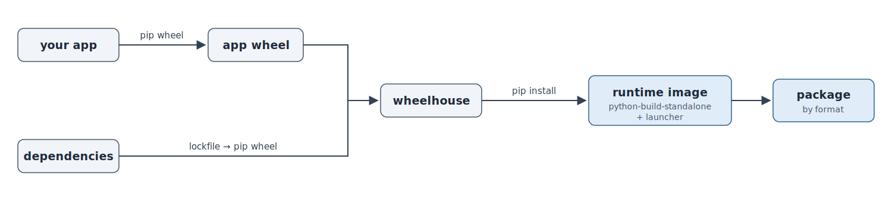

How it works
============

pyappdist installs your app into a real Python runtime and ships that runtime.
There is no freezing and no code analysis.

         wheelhouse, pip-installed into a python-build-standalone runtime image
         with a launcher, then packaged by format.
   :width: 100%

The image — a self-contained, ready-to-run directory — is built the same way for
every target. Only the final **packaging** step branches by ``format``.

.. _project-prereqs:

What your project must satisfy
------------------------------

pyappdist installs your app the same way ``pip`` would — it builds wheels and
installs them into the bundled runtime, it never freezes source files directly.
Two things about the project therefore have to be true before it can be packaged.

1. The project must build a wheel with pip
~~~~~~~~~~~~~~~~~~~~~~~~~~~~~~~~~~~~~~~~~~~~

Your app must be a proper installable package, not a loose collection of
scripts. Concretely, running

.. code-block:: bash

   pip wheel --no-deps .

in the project directory must succeed and produce a ``.whl`` file. Any modern
build backend works (setuptools, hatchling, flit, poetry-core, …) as long as
``pyproject.toml`` declares a ``[build-system]`` and ``pip wheel`` can build it.
If ``pip wheel`` fails — or there is no packaging metadata at all — pyappdist
cannot distribute the app.

2. Each launcher must run from the installed wheel
~~~~~~~~~~~~~~~~~~~~~~~~~~~~~~~~~~~~~~~~~~~~~~~~~~~~~

A launcher never executes a source file by path. It runs against the
**installed** package, in exactly one of these two forms — which one is chosen by
the launcher's :ref:`entry <config-launchers>`:

* ``python -m <module>`` — used when ``entry`` has **no** colon (``"myapp.cli"``).
  ``python -m <module>`` must work once the wheel is installed.
* ``python -c "from <module> import <callable>; <callable>()"`` — used when
  ``entry`` is ``"module:callable"`` (``"myapp:main"``). The callable must be
  importable from the installed package and callable with no arguments.

The easiest way to confirm both conditions is to reproduce what pyappdist does, in
a throwaway virtualenv:

.. code-block:: bash

   python -m venv /tmp/check && /tmp/check/bin/python -m pip install .
   /tmp/check/bin/python -m myapp.cli                          # entry = "myapp.cli"
   /tmp/check/bin/python -c "from myapp import main; main()"   # entry = "myapp:main"

If those run from the *installed* package, the corresponding launcher will work.
If they only work in your source checkout (because they read files that the wheel
doesn't include, or import a top-level script that isn't part of the package),
fix the packaging first — the launcher would fail the same way.

The pipeline
------------

#. **App wheel.** Your project is built into a wheel with ``pip wheel
   --no-deps`` using its own PEP 517 backend (so any backend works).

#. **Dependency wheels.** Dependencies are pinned from your project's lockfile,
   exported to a dependency file (a PEP 751 ``pylock.toml`` for uv, a
   ``requirements.txt`` for the other managers), and turned into wheels by the
   *target* runtime's ``python`` (``pip wheel -r``). Resolving on the target
   interpreter keeps environment markers and wheel tags natively correct. See
   :doc:`dependencies`.

#. **Runtime.** A `python-build-standalone
   <https://github.com/astral-sh/python-build-standalone>`_ runtime for the
   requested version is downloaded, verified against its ``SHA256SUMS``, cached,
   and extracted.

#. **Image.** Every wheel in the wheelhouse is installed into the runtime offline
   (``pip install --no-index``), and the standard library / site-packages are
   byte-compiled. The result is a self-contained, ready-to-run directory.

#. **Launcher.** One launcher per ``[[tool.pyappdist.launchers]]`` entry. On
   Windows it is a small C stub (``launcher.exe``) compiled with MSVC; for a macOS
   ``.app`` it is a compiled Mach-O stub (clang); for Linux and the macOS
   ``.run`` it is a relocatable shell wrapper. Either way it starts the
   bundled interpreter and runs your entry point.

#. **Packaging.** The image is turned into the target's package: an ``.msi`` or
   ``.msix`` on Windows, or a self-extracting ``.run`` on Linux/macOS. See the
   per-format pages under :ref:`Output formats <config-formats>`.

The launcher
------------

One launcher per entry point starts the bundled interpreter and runs your code.
The kind depends on the target **format**, not just the OS.

**Windows** (``.msi`` / ``.msix``) — a thin C process (``launcher.exe``), not an
embedded interpreter:

* It spawns the bundled ``python.exe`` / ``pythonw.exe`` with ``-I`` (isolated
  mode) and strips ``PYTHON*`` environment variables, so the user's environment
  cannot interfere.
* Because it never embeds ``pythonXX.dll``, there is no C-API version coupling —
  the same stub works across Python versions.
* App-specific values (the interpreter path, the bootstrap program, fixed
  arguments, icon, and version resource) are baked into a generated header and
  ``.rc`` resource at build time; the C source is never edited.

**macOS app bundle** (``.app`` / ``.dmg``) — a compiled Mach-O C stub (built with
``clang``) at ``Contents/MacOS/<name>``. It execs the bundled interpreter under
``Contents/Resources/python`` with the same isolated-mode bootstrap. Like the
Windows stub it embeds no interpreter, so it is decoupled from the Python C-API;
app-specific values are baked into a generated header at build time.

**Linux, and macOS** ``.run`` — a relocatable shell wrapper that
resolves its own location and execs the bundled interpreter with the same
isolated-mode bootstrap — no compiler needed.

GUI startup errors (Windows)
----------------------------

GUI launchers run under ``pythonw.exe`` with no console, so a failed import would
otherwise vanish silently. For ``gui = true`` launchers, pyappdist wraps the
entry-point **import** in ``try/except`` and, on failure, shows the error in a
message box (via ``ctypes``). Exceptions raised *after* your entry point starts
running are your app's responsibility.

Upgrades
--------

The MSI recognizes and replaces an installed copy via a stable ``upgrade-code``
GUID — see :ref:`the MSI upgrade details <platforms/windows-msi:Upgrades>`. The
``.run`` installers replace any existing install in place; application-level
updates are otherwise the app's own responsibility — pyappdist provides no
auto-update mechanism.
